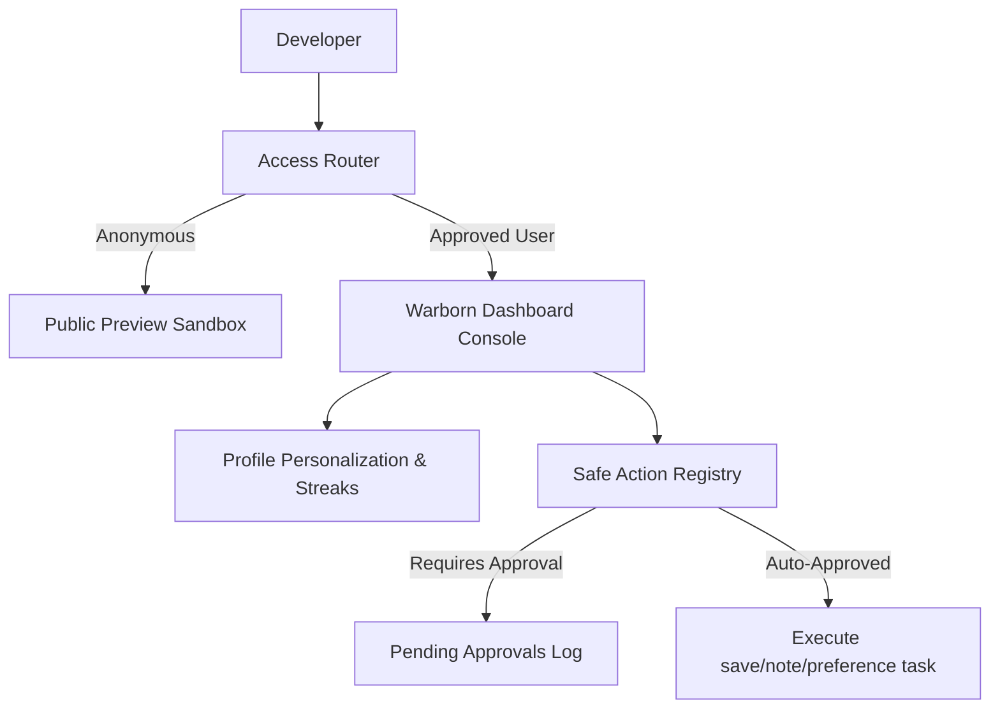

# Day Log: Introducing Intent-Aware Action Kernels, Personalization Memory, and Light-Theme Visual Traces — July 12, 2026

**14 commits. 37 files changed. 1,120 insertions, 610 deletions.**

Today marked a foundational transition for the Warborn operating system. We moved beyond a passive conversational interface to establish a **secure, bounded action and personalization kernel**. Authenticated dashboard users can now trigger safe, schema-validated tool executions directly from chat, while the system dynamically adapts to their custom learning progress and styling settings across light and dark modes.

Here is a full breakdown of the day's development sprint.

---

## 1. Context & Architecture Overview

To transition the assistant into a functional operating system layer, we designed three major loops:
1. **Launch Governance (V12)**: Hardening session persistence, waitlist invite workflows, and staged feature rollouts to safeguard the private dashboard from preview environments.
2. **Personalization Memory (V13)**: Creating structured JSON profile schemas and learning trackers (streak counts, weak category tables) to inject context dynamically into runtime prompts.
3. **Safe Tool Executions (V14)**: Building a bounded tool actions registry with manual approval loops and transaction logs.



---

## 2. Technical Implementation Details

### 2.1 Launch Governance & Rollout Controls (V12)
We created `AccessRequest` and `SystemConfig` tables to manage Waitlist applications and staged feature flags. Access is dynamically gated by MD5-hashed identifiers, allowing us to roll out the system to a clean percentage of waitlist users deterministically.

### 2.2 Profile Memory & Streaks (V13)
We defined the `UserProfileMemory` and `LearningProgress` tables. As you correct grammar mistakes inside the chat interface, the system records streak milestones and focus categories. This is injected as a token-capped context block (limited to 500 tokens) before the agent runs, making each response more personalized over time.

### 2.3 Safe Tool Actions & Approvals Loop (V14)
To ensure safety, the AI is blocked from executing code directly. Instead, it emits a suggested action payload:
* **`save_corrected_example`**: Stores a corrected sentence to your personal vocabulary library.
* **`create_lesson_note`**: Creates structured notebook items.
* **`update_preference`**: Saves custom tone and style profiles.
* **`mark_pattern_mastered`**: Checklist grammar topics.
* **`create_followup_practice`**: Adds practice reminders (which require manual approval).

State-changing actions log a pending entry inside `ActionLog` and queue a confirmation modal in the UI.

---

## 3. Resolving the Database Integrity Constraint

When deploying the user roles, we encountered a standard migration issue:
```sql
sqlalchemy.exc.IntegrityError: column "role" of relation "users" contains null values
[SQL: ALTER TABLE users ADD COLUMN role VARCHAR(50) NOT NULL]
```
This happened because the `users` table already had active rows from previous testing sessions. Adding a non-nullable column without a default value failed database-level constraints.

To fix this, we modified the Alembic migration script to perform a multi-step update:
1. **Add the column as nullable**: `op.add_column('users', sa.Column('role', sa.String(50), nullable=True))`
2. **Backfill existing rows**: `op.execute("UPDATE users SET role = 'approved_user'")`
3. **Alter the column to non-nullable**: `op.alter_column('users', 'role', nullable=False)`

This successfully migrated the database without losing any test user accounts.

---

## 4. UI Polish & Theme Integration

* **Premium Motherboard Canvas**: We integrated the `<PremiumPixelBackground />` directly on the `/warborn` landing page, providing live, interactive circuit animations.
* **Light-Theme Adaptations**: Swapped out hardcoded dark colors for Tailwind `bg-background` and `text-foreground` variables, making the circuit traces, vias, and data packet glows render beautifully in both light and dark modes.
* **Telemetry Dashboard Card**: Added a "Cognitive Kernel Memory" panel to the Mission Control dashboard, showing accepted corrections count, active streaks, and current weakness categories.

---

## 5. Verification & Validation Outcomes

* **Integration Tests**: All **33 python tests passed cleanly** (100% success rate).
* **Production Build Compile**: Next.js client compiled successfully with zero type checking or compilation errors.
* **Source Sync**: Staged, committed, and pushed updates successfully to remote `main`.

---

## 6. Codebase Audit, Stability, & Gemini Integration Sprint

Later in the day, we executed a comprehensive codebase audit and stability hardening pass across the entire folder to resolve bugs, achieve complete type safety, and integrate the Gemini API for free-tier live testing:

### 6.1 Bounded Action Executor Trigger (V14 Fix)
- **Problem**: When a manual action (like a practice reminder) was approved in the UI, `decide_approval` updated the database flags but never actually triggered the action's side effects.
- **Fix**: Hooked `ActionExecutionService.execute_log_action` directly into the approval decision flow so that the action executes immediately upon confirmation, streamlining commits to prevent double transactions.

### 6.2 Seeding & Database Integrity Hardening
- **Problem**: Raw SQL user insertions in `seed.py` lacked the `role` column. On clean databases, this raised a PostgreSQL `NOT NULL` constraint violation and crashed the database initialization.
- **Fix**: Added the `role` column set to `'approved_user'` directly in the raw SQL inserts and added assertions to inform the type checker that the fetched rows are valid.

### 6.3 100% Type-Safe Backend (Mypy Sprint)
- **Problem**: Mypy reported 30 typechecking errors regarding shadowed built-in list attributes inside storage classes, unannotated dictionaries, and incorrect sequence list conversions.
- **Fix**: 
  - Swapped out built-in `list` type annotations for `List` imported from standard `typing` inside storage classes to prevent class-method namespace collisions.
  - Declared `file_metadata` as `Dict[str, Any]` to support array values under Google Drive uploads.
  - Successfully scanned the entire backend codebase: **Success: no issues found in 98 source files**.

### 6.4 Dynamic Gemini API Integration (OpenAI Compatibility Mode)
- **Problem**: The system had only hardcoded OpenAI endpoint settings, preventing testing with the user's Gemini API Key.
- **Fix**: 
  - Updated the agent runtime (`runtime.py`) to automatically detect Google Gemini key signatures (keys starting with `AIza` or `AQ.`).
  - Implemented automatic redirection to Google's official **OpenAI-compatible gateway**: `https://generativelanguage.googleapis.com/v1beta/openai/v1/chat/completions`.
  - Configured model mapping to `gemini-flash-latest` which works on the free tier. Verified successfully with a live response output.

### 6.5 Sandbox Timeout & Intent Refinements
- **Problem**: Strict 5-second limits caused premature timeout failures due to transient free-tier Gemini latency spikes. Whitelist intent matching was also blocking valid sentences.
- **Fix**:
  - Increased public sandbox execution timeout limits to **15.0 seconds** (and client request timeout to **20.0 seconds**).
  - Mocked the timeout values in unit tests to keep tests fast (running the entire suite in `0.35` seconds).
  - Swapped the strict whitelist classifier for a **blacklist filter** that only blocks clearly off-topic topics (like coding and scripting tasks), allowing basic conversation and direct Hinglish queries to respond naturally.
  - Updated the system prompt to politely decline off-topic queries.

