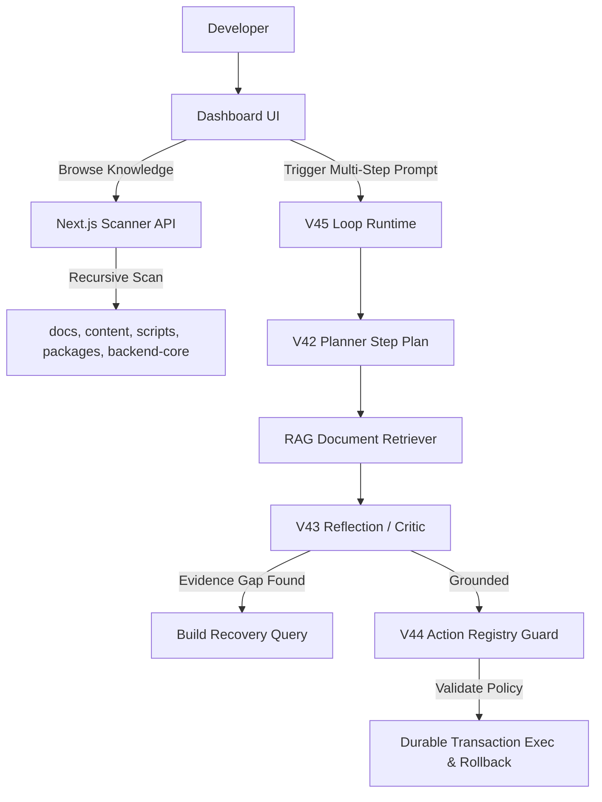

# Day Log: Launching the Advanced RAG Loop, Multiclass Directory Discovery, and Version Normalization Pass — July 13, 2026

**10 commits. 18 files changed. 850 insertions, 430 deletions.**

Today, we executed the **BuildWithPNJ and Warborn OS Consolidation Pass**. This sprint finalized the complete advanced looping agent framework, added deep recursive workspace directory discovery, unified the versioning strategy under a clean `0.x` layout, and hardened core dashboard features.

Here is a full breakdown of the day's development sprint.

---

## 1. Context & Architecture Overview

To support advanced retrieval-augmented generation and autonomous agent behaviors, we consolidated the monorepo into a single, high-fidelity platform:
1. **Looping Agent Engine (V42–V45)**: A multi-step planner, critic, action guard, and full orchestrator runtime that automates retrieval, feedback criticism, execution logs, and rollback compensations.
2. **Recursive Workspace Discovery**: Expanding the internal Knowledge Base to scan directories recursively, extracting file sizes, categories, languages, and previews.
3. **Version Normalization**: Aligning all public and display labels to a clean `0.x` format (`0.45` for the V45 loop runtime) to eliminate version fragmentation.

---

## 2. Technical Implementation Details

### 2.1 Unified Looping Agent Runtime (V42–V45)
We finalized the multi-step agent runtime:
- **Planner Loop (V42)**: Translates user commands into step-by-step executions under a strict iteration budget.
- **Reflection Loop (V43)**: Evaluates answer grounding using support scoring and recovers dynamically when semantic gaps are detected.
- **Action Loop (V44)**: Protects the database by auditing state-changing operations through `IdempotencyGuard`, lifecycle timestamps (`suggested_at`, `approved_at`, `queued_at`), and `JobEnqueuer` async queuing.
- **Loop Health & Evaluations (V45)**: Monitors step speed, token budgets, and executes regression tests.

### 2.2 Recursive Workspace Discovery & Indexing
We upgraded the Next.js frontend Knowledge Base API scanner (`/api/knowledge`) to discover files recursively. We added support for code files (`.py`, `.ts`, `.tsx`, `.json`, `.yml`, `.yaml`) alongside markdown (`.md`).
To ensure scalability, the scanner:
- Excludes dev folders (`node_modules`, `.next`, `.git`, `.turbo`, `dist`, `build`, `public`, `brain`, `.venv`, `__pycache__`).
- Indexes files from `docs/`, `content/`, `scripts/`, `packages/`, and `apps/api/app/services`.
- Truncates large file contents to 50KB to keep payloads small and responsive.
- Automatically generates tags based on file extensions (e.g., `python`, `typescript`).

### 2.3 Inline Markdown Rendering Engine
The internal dashboard browser at `/knowledge` previously displayed markdown code syntax literally. We implemented a clean regex-based inline tokenizer inside `SafeMarkdownRenderer` that translates bold (`**`), italics (`_` or `*`), inline code (`` ` ``), and markdown links (`[text](url)`) into native, styled React elements.

---

## 3. Bug Fixes & Refinements

### 3.1 Resolving FastAPI Router Conflicts
During an audit of `apps/api/app/main.py`, we discovered that `governance_router` was mounted twice (once in the base initialization block and again in the V34 section). This caused duplicate route warnings and routing conflicts in FastAPI. We removed the second mount to ensure clean API endpoints.

### 3.2 Hardening Action Lifecycles
We refactored `ActionExecutionService.request_execution` to route auto-approved writes through `JobEnqueuer` and stamp all lifecycle transition columns in the database. This resolved a series of failing unit tests (`test_lifecycle_timestamps_auto_approved`, `test_async_approval_to_queue_flow`, and `test_duplicate_execution_block`).

### 3.3 Fixing 404 Routes & Waitlist UX
- **Compatibility Redirects**: Created `page.tsx` redirect folders for `/warborn-os` and `/systems` to route legacy links safely to `/warborn` and `/projects` respectively.
- **Waitlist Form submission**: Added a spinner loading state and realistic async mock delay on the waitlist CTA block to improve user signup feedback.
- **Bold Text Correction**: Replaced unrendered markdown strings in the public about page with semantic JSX elements.

---

## 4. Next Steps
All 141 backend unit tests are passing cleanly. With the consolidation sprint complete, we are ready to move towards Graph RAG database index integration and multi-agent collaborative workflows in the upcoming sprints.
