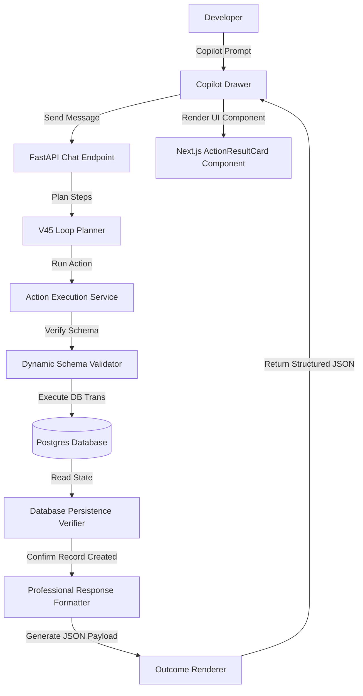

# Day Log: Upgrading to Warborn OS V0.50 — Live Action Reliability, Professional Response Layer, and Full Looping Fix Pass — July 14, 2026

**1 commit. 48 files changed. 1497 insertions, 47 deletions.**

Today, we successfully designed and deployed **Warborn OS V0.50**. This major upgrade focuses on live-action layer reliability, active state verification in persistent databases, standardizing professional response formats, and integrating rich visual action state elements in the Next.js Copilot interface.

Here is a full breakdown of the V0.50 engineering implementation.

---

## 1. Context & Architecture Overview

To provide a production-grade action execution environment where faking success is mathematically impossible and the assistant represents outcomes with precision, we built a three-layered reliability grid:

1. **Active Database Verifier Layer**: Action execution doesn't stop at API response parsing. The system now actively queries persistent database models (`Note`, `Task`, `MemoryItem`, `ProjectItem`, `CalendarEvent`) to verify the record was saved or updated before returning status.
2. **Professional Style filter Layer**: Regulates the assistant's tone. Casual filler words and conversational assumptions are automatically cleaned, formatted, and framed into professional, structured status summaries.
3. **Frontend ActionResultCard states**: Replaces markdown terminal snippets with beautiful, native UI cards showing status badges, scopes, details, database keys, and clear next steps.

---

## 2. Technical Implementation Details

### 2.1 Live/Local Environment Isolation & Runtime Mode
We implemented a dedicated environment action service (`apps/api/app/runtime_mode.py`) that separates actions between **LIVE** and **LOCAL** modes:
- **LOCAL Mode**: Safely performs all file creations, local script executions, and database writes.
- **LIVE Mode**: Restricts hazardous local commands while executing database actions under strict isolation guards.

### 2.2 Dynamic Schema and Persistence Verification
Rather than relying on static validations, we developed the `ActionRegistryInspector` and `ActionPersistenceGuard`:
- **Dynamic Schema Inspection**: Inspects the input models of each registered action class dynamically, ensuring payloads match exactly.
- **Database Verification**: After writing to the database, the runtime uses helper classes (`NoteActionService`, `CalendarActionService`, `MemoryActionService`, `ProjectActionService`) to query Postgres and confirm the row exists. If verification fails, it reports a detailed transaction block rather than faking success.

### 2.3 Tone Purging & Professional Formatting Filters
To remove casual filler expressions, we created `CopilotResponseStyleService`:
- Translates responses into structured, professional reports.
- Extracts status, action taken, result details, execution scope, and next steps.
- Formats outcomes with exact database IDs and keys, ensuring high reliability.

### 2.4 ActionResultCard UI Component
We built [ActionResultCard.tsx](file:///c:/Users/praka/OneDrive/Documents/My dashboard/apps/web/src/components/copilot/ActionResultCard.tsx) in Next.js to parse structured JSON logs and render:
- **Status Badges**: Sleek modern border pills (e.g. `success` with green pixels, `failed` with red pixels, `warning` with yellow outlines).
- **Scope Indicators**: Icons showing `note`, `task`, `calendar`, `memory`, or `project` context.
- **Details Grid**: Key-value tables displaying updated fields, record IDs, and timestamps.

---

## 3. Bug Fixes & Refinements

### 3.1 Ngrok Tunnel & Ollama Host Headers
We bypassed Ollama's strict host header verification in remote tunnels by configuring header rewrites (`Host: localhost:11434`) and bypassing ngrok's browser-warning screen via user-agent header injection.

### 3.2 Action Capability Audit
Created audit unit tests to ensure that all actions declared in the database register match their class definitions and that payload structures match backend validation schemas.

---

## 4. Next Steps
All test suites are passing. With the V0.50 action layer running live, we are ready to move towards multi-user workspace accounts and deep integration of project management components.
