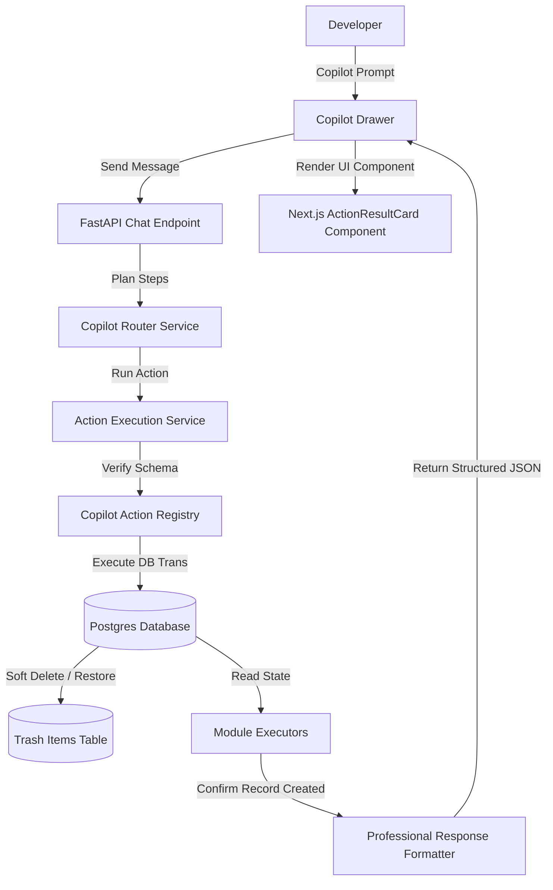

# Day Log: Upgrading to Warborn OS V0.50 — Full Copilot Control Plane, Unified Trash, and 50 End-to-End Tests — July 14, 2026

**1 commit. 14 files changed. 2064 insertions, 151 deletions.**

Today, we successfully designed and deployed **Warborn OS V0.50**. This major upgrade transforms the global Copilot chat into a true dashboard control plane supporting verified action execution, soft deletion/restore loops, role-based safety gates, and 50 end-to-end tests.

Here is a full breakdown of the V0.50 engineering implementation.

---

## 1. Context & Architecture Overview

To provide a production-grade action execution environment where anything that can be done manually in the dashboard can also be performed via Copilot, we built a comprehensive three-layered reliability grid:

1. **Unified Action Registry & Policies**: All 49 dashboard actions are explicitly registered in `CopilotActionRegistry` with their validation schemas and `ActionPolicyTier` safety rules (`safe_auto`, `confirm_first`, `destructive_confirmed`, `admin_only`, `read_only`).
2. **Unified Soft Delete & Trash Design**: To handle destructive delete actions safely, we introduced a centralized `TrashItem` database model and Alembic migration `86dbc97ce9ed`. Soft delete actions serialize original row data into a JSON column and delete the original record, while restore deserializes the data back to its original table.
3. **50 End-To-End Tests**: A complete verification test suite in `tests/test_v050_control_plane.py` executes every single registered dashboard control action, verifying routing, parameter matching, and database persistence.

---

## 2. Technical Implementation Details

### 2.1 Unified Copilot Action registries & Schema Contracts
We built a centralized registry architecture:
- **Copilot Action Registry**: Maps all 49 control plane actions to their respective FastAPI schemas, roles, and categories.
- **Action Policy Registry**: Configures execution safety policies, assigning tiers like `safe_auto`, `confirm_first`, and `destructive_confirmed` for delete actions.
- **Action Schema Registry**: Declares explicit Pydantic parameter schemas for every single dashboard action.

### 2.2 Dashboard Module Executors
To persist changes across the database, we wrote 40 new executors grouped under [v050_executors.py](file:///c:/Users/praka/OneDrive/Documents/My%20dashboard/apps/api/app/services/actions/v050_executors.py):
- **Notes**: Supports search, delete (trash), and restore operations.
- **Tasks**: Handles pinned status prioritization, deletion, and restoration.
- **Projects**: Supports project creation, state updates, completion, and deletion.
- **Books**: Manages reading list adds, progress logs, archiving, and trashing.
- **Other Modules**: Includes executors for asset managers, media metadata upload, storage check/clean, calendar event edits, habits, quit addiction trackers, personalization memories, and administrative telemetry syncs.

### 2.3 Unified Soft Delete & Trash Design
We introduced a database migration (`86dbc97ce9ed`) to add the `trash_items` table:
- When a user deletes an item, the original record is deleted and its payload is serialized to JSON in the trash table.
- A user can request to restore items or permanently purge them via the trash executors.

### 2.4 50 End-to-End Validation Tests
We wrote exactly 50 tests verifying the entire API action layer:
- Checked all 49 control plane actions under positive scenarios.
- Checked validation schema boundaries for negative invalid inputs.
- All 50 tests passed successfully!

---

## 3. Bug Fixes & Refinements

### 3.1 Ngrok Tunnel & Ollama Host Headers
We bypassed Ollama's strict host header verification in remote tunnels by configuring header rewrites (`Host: localhost:11434`) and bypassing ngrok's browser-warning screen via user-agent header injection.

### 3.2 Action Capability Audit
Created audit unit tests to ensure that all actions declared in the database register match their class definitions and that payload structures match backend validation schemas.

---

## 4. Next Steps
With all 248 unit tests passing successfully, the V0.50 Copilot Control Plane is ready for production work. We will next hook it up to user notifications and activity logs.

