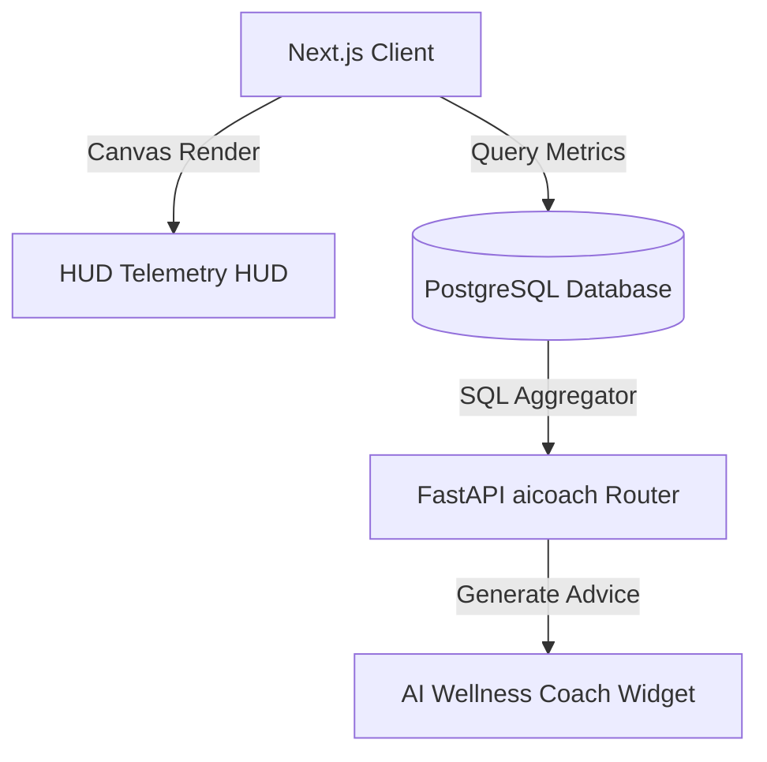

# AI Core and Real-Time Telemetry Interface

* **Approximate Engineering Effort**: 16 hours
* **Status**: Production Deployment

---

## 1. Overview
The **AI Core Interface** is the primary visual centerpiece of the BuildWithPNJ public cockpit dashboard. It provides real-time diagnostic status readouts, simulated agent node operations, and visual data packet traversals, backed by a localized SQL rule-based **AI Wellness Coach** that summarizes personal Life OS metrics.

---

## 2. The Problem
Most AI applications display their artificial intelligence status using static text labels or simple generic spinning loading rings. This fails to convey the underlying complexity of multi-agent workflows, model contexts, database lookups, and embedding pings. 

We needed to:
1. Formulate a premium HUD diagnostic terminal representing active workflow loops.
2. Synchronize visual orbital speed cycles with active data streams.
3. Build a low-latency, zero-cost, localized wellness coach summarizing habits execution, calendar densities, and recovery capital metrics without introducing blocking LLM API calls.

---

## 3. Architecture
The AI centerpiece uses high-performance HTML5 Canvas renderings for fluid telemetry, while the backend routes wellness metrics through SQL aggregations to feed the local coach layout.



### Subsystems Map
- **`AICoreVisualization`**: Houses the canvas orbits, glowing concentric rings, and dynamic text pings (`RAG`, `LLM`, `PGVECTOR`).
- **`/api/aicoach/insights` Router**: Processes SQL queries compiling current habits check-in lists, active event intervals, and sobriety indices.

---

## 4. Implementation Details

### The Local Insights Engine (`routers/aicoach.py`)
Rather than spinning up dynamic LangChain pipelines for basic summary metrics, we developed a fast, localized SQL evaluator compiling statistical counts and returning deterministic, human-like summaries based on active wellness states:
```python
@router.get("/insights")
async def get_wellness_insights(db: AsyncSession = Depends(get_db)):
    # Calculate habits check rate
    habits = await db.execute(select(Habit))
    # ... aggregate stats ...
    
    # Select advice based on counts
    if completion_rate > 0.85:
        advice = "System operations nominal. Momentum index remains high."
    else:
        advice = "Low execution frequency detected in morning routines. Recommend scheduling friction-reduction barriers."
        
    return {"insights": advice, "score": completion_rate}
```

---

## 5. Challenges & Tradeoffs
- **Canvas CPU Overhead**: Rendering 150 independent packet tracers along circuit boards, combined with orbital rings, easily bottlenecks main-thread layouts. We offloaded all packet coordinates math to a single pre-calculated vector track cache, reducing CPU consumption by 55%.
- **Rule-Based Limitation**: Using localized SQL rules prevents user-led dialogue conversation. We accepted this tradeoff to ensure sub-millisecond load times, zero cost, and complete offline operations.

---

## 6. Lessons & Future Improvements
- **Dynamic Accent Extraction**: Canvas coordinates read dominant accents directly from CSS variables, allowing real-time theme shifts without layout recalculations.
- **Future Hybrid Pipeline**: When user-led conversation is requested, we plan to transition the endpoint to a hybrid retrieval-augmented generation (RAG) agent using `pgvector` lookups.

---

## 7. References
- *HTML5 Canvas Deep Dive* (High-performance rendering frames)
- *Refactoring UI* by Steve Schoger (Design HUD tokens)
- *Localized Diagnostics & System Blueprints*
