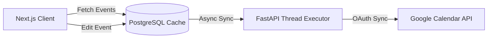

# Bi-Directional Google Calendar Sync Engine

* **Approximate Engineering Effort**: 20 hours
* **Status**: Production Deployment

---

## 1. Overview
The **Google Calendar Sync Engine** in Warborn OS connects the local database schedules cache with remote Google Calendars. It enables bi-directional scheduling updates, maps multi-provider timezone configurations, and bypasses Google API latency thresholds using an optimistic database cache layer.

---

## 2. The Problem
Direct, synchronous calls to Google Cloud APIs during page renders introduce substantial latencies (often exceeding 800ms) due to OAuth handshakes and upstream parsing. Furthermore, Google Cloud has strict rate limits. 

To resolve these, we needed to:
1. Establish a local PostgreSQL transactional cache mapping Google Cloud events.
2. Synchronize inserts, updates, and deletes from the web interface optimistically, writing to the local cache first and propagating updates downstream in a non-blocking queue.
3. Handle complex timezone conversions so that calendar events display accurately according to the user's current regional node.

---

## 3. Architecture
The integration utilizes a dual-path synchronization structure. Reading processes retrieve cached PostgreSQL rows, while writing processes update local states before dispatching asynchronous tasks to propagate updates downstream.



### Schema Architecture (`models/calendar_event.py`)
- **`CalendarEvent`**: Main database table storing `id`, `google_event_id`, `title`, `description`, `start_time`, `end_time`, `timezone`, and `sync_status` (pending, synced, error).

---

## 4. Implementation Details

### Non-Blocking Google Client execution (`storage/services.py`)
Because uvicorn runs on a single-threaded asynchronous event loop, blocking CPU or network execution frames (like Google client discovery mappings) immediately blocks other API requests. We offload these calculations to thread pools via `asyncio.to_thread`:
```python
async def push_event_to_google(self, event_id: str):
    # Fetch local event credentials
    event = await self.db.get(CalendarEvent, event_id)
    # Offload the blocking OAuth network request
    await asyncio.to_thread(
        self.google_client.events().insert(
            calendarId='primary', 
            body=event.to_google_format()
        ).execute
    )
```

---

## 5. Challenges & Tradeoffs
- **Timezone Drift**: Mapping events created in different regions (e.g. India versus United States) resulted in offset drift. We solved this by forcing all timezone parsing to follow standardized IANA strings, mapping UTC boundaries in PostgreSQL while using client-side timezone formats (e.g. `Asia/Kolkata`, `America/New_York`) dynamically on the frontend.
- **Cache Synchronization Conflict**: If an event is updated on both the Google Calendar dashboard and the Warborn OS dashboard concurrently, conflicts arise. We resolved this by prioritizing the latest update timestamp, using Google's `etag` metadata checks to reject stale transactions.

---

## 6. Lessons & Future Improvements
- **Optimistic UI Updates**: Updating local database models first and refreshing state immediately makes the interface feel instantaneous, even if Google API replication takes several seconds.
- **Future Webhooks Support**: Implementing Google Calendar push notifications via webhooks to update the local database cache instantly when events are modified outside the app.

---

## 7. References
- *Google Calendar API v3 Guidelines* (OAuth Token Caching)
- *Database Caching & Replication Patterns* (Optimistic UI designs)
- *IANA Timezone Database specifications*
