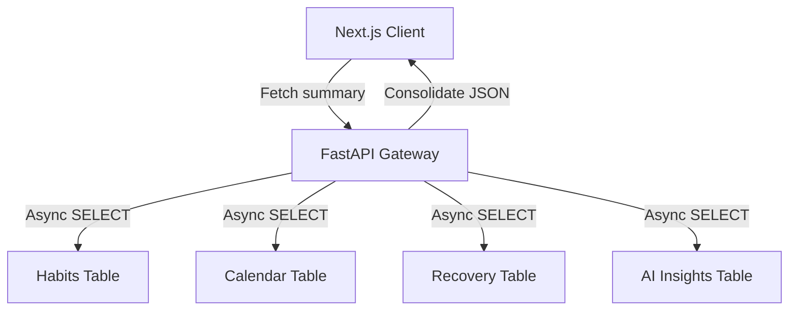

# Mission Control Dashboard Cockpit

* **Approximate Engineering Effort**: 10 hours
* **Status**: Production Deployment

---

## 1. Overview
**Mission Control** is the central cockpit dashboard of Warborn OS. It consolidates daily routines (morning/evening habits checklists), active Google Calendar schedules, addiction recovery streaks, and localized AI Coach insights into a single, high-fidelity HUD interface.

---

## 2. The Problem
Scattering personal data across separate sub-pages (e.g. going to `/habits` for checklist items, `/calendar` to check events, and `/recovery` to monitor sobriety) fragments user attention and increases cognitive load. 

To maximize operational efficiency, we needed to:
1. Construct a unified layout aggregating the most critical real-time wellness widgets.
2. Maintain high-end visual consistency using dark glassmorphic panels, neon borders, and clean typography.
3. Optimize database queries so that rendering the dashboard loads in under 12 milliseconds despite pulling data from five separate tables.

---

## 3. Architecture
The front-end uses Next.js app router directories, compiling sub-widgets in Client components. The backend exposes a composite `/api/dashboard/summary` endpoint that merges query results from multiple tables into a single JSON response, eliminating duplicate fetches.



---

## 4. Implementation Details

### Glassmorphic Blueprints UI Theme
The interface utilizes CSS-based grid lines and backdrop filters to create a floating HUD hud structure. We define core glass styling tokens inside `index.css`:
```css
.hud-panel {
  background: rgba(10, 15, 30, 0.45);
  backdrop-filter: blur(12px);
  border: 1px solid rgba(56, 189, 248, 0.15);
  box-shadow: 0 8px 32px 0 rgba(0, 0, 0, 0.37);
}
```

---

## 5. Challenges & Tradeoffs
- **Cumulative Query Latency**: Performing sequential synchronous calls to PostgreSQL for habits, logs, events, and trackers created a database bottleneck. We resolved this by wrapping the queries inside an asynchronous `asyncio.gather()` block, allowing PostgreSQL to execute all lookups concurrently.
- **Screen Density Management**: Packing calendar grids, habits checklists, and recovery statistics into a single screen can result in visual clutter. We prioritized components using clean grid columns, wrapping smaller lists in custom scroll regions and using hover macros to reveal secondary options.

---

## 6. Lessons & Future Improvements
- **Asynchronous Data Pre-fetching**: Fetching the dashboard summary payload on layout mount makes the transition from the homepage feel completely instantaneous.
- **Future Modular Hud**: We plan to allow users to customize their cockpit by dragging, dropping, resizing, and toggling specific operational widgets dynamically.

---

## 7. References
- *Designing for HUDs & Science Fiction UIs*
- *Asynchronous SQLAlchemy Query Planners*
- *Tailwind & CSS Backdrop Filter Performances*
