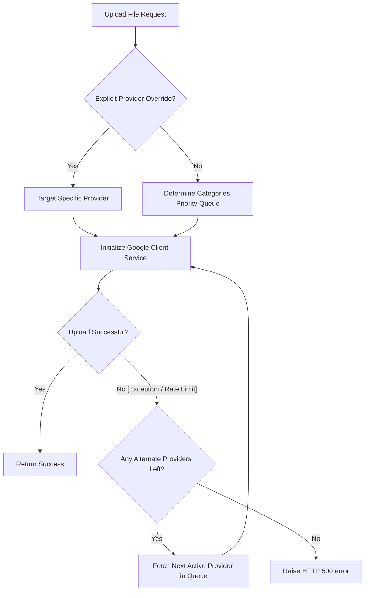

# EXP-11: Deep Dive — Multi-Account Cloud Storage Virtualization & Life OS Core Integration

**Status:** Completed (Production-Ready)  
**Category:** Systems Architecture & Design Engineering  
**Date:** 2026-07-10  
**Authors:** Principal UX Architect & Systems Engineer  

---

## 1. The R&D Challenge: Fragmentation of the Developer Workspace

Modern developer environments are notoriously fragmented. A typical day requires juggling a note-taking application (Notion), a task checklist (Linear), an operational calendar (Google Calendar), cloud backups (Google Drive), and wellness tracking metrics (Habits & Recovery calculators). 

This fragmentation causes severe context-switching overhead and creates silent data silos. Moreover, cloud integrations are traditionally built on single-account configurations. If a specific cloud credential expires, gets rate-limited, or runs out of quota storage, the entire application's upload flow fails immediately.

In this experiment, we set out to build **Warborn OS (V2)**—an integrated developer cockpit that solves these challenges through:
1. **Multi-Account Storage Virtualization**: Virtualizing multiple Google Drive accounts (Drive A for primary notes, Drive B for heavy media) with automatic priority-based failover.
2. **Bi-Directional Calendar Caching**: A local transactional database layer that queries and synchronizes with Google Calendar, resolving rate-limiting delays.
3. **Integrated Life OS Core**: Consolidating habits routines, sobriety trackers, and Markdown reflections into a unified, clean database schema mapped to a premium system cockpit.

---

## 2. Architecture & Code Logic

To achieve this, we decoupled the database and API routers from cloud-specific logic. Instead of hardcoding credentials in `.env` variables, we moved them into a PostgreSQL schema with encryption layers.

### Database Schemas (Normalized & Encrypted)

We designed a symmetric encryption layer using **Fernet AES-256**. Refresh tokens and OAuth client secrets are encrypted on writing and decrypted on-the-fly during service initialization.

```python
# app/models/storage_provider.py
class StorageProvider(Base, UUIDMixin, TimestampMixin):
    __tablename__ = "storage_providers"

    provider_label: Mapped[str] = mapped_column(String(50), nullable=False)
    account_email: Mapped[str] = mapped_column(String(255), nullable=False)
    is_active: Mapped[bool] = mapped_column(Boolean, nullable=False, default=True)
    priority: Mapped[int] = mapped_column(Integer, nullable=False, default=0)
    
    # Encrypted fields
    encrypted_refresh_token: Mapped[str] = mapped_column(Text, nullable=False)
    client_id: Mapped[str | None] = mapped_column(String(255), nullable=True)
    encrypted_client_secret: Mapped[str | None] = mapped_column(Text, nullable=True)
```

---

## 3. Priority-Based Upload Failover Algorithm

One of the key engineering achievements is the **Storage Failover Pipeline**. When a developer uploads a file (either explicitly targeting a drive or letting the category routing engine decide), the `StorageManager` executes the following execution logic:



The corresponding backend code is written using non-blocking asynchronous executor threads to prevent Google's client HTTP connection pools from locking FastAPI's main event loop:

```python
# app/storage/services.py
async def upload_file_with_failover(
    self, 
    user_id: str, 
    filename: str, 
    content: bytes, 
    mime_type: str, 
    db: AsyncSession
) -> dict:
    providers = await self.get_active_priority_queue(user_id, db)
    
    for idx, provider in enumerate(providers):
        try:
            # Non-blocking executor block
            service = await self.get_gdrive_service(provider)
            uploaded_file = await asyncio.to_thread(
                self._execute_upload_call, 
                service, 
                filename, 
                content, 
                mime_type
            )
            return {
                "status": "success",
                "provider": provider.provider_label,
                "file_id": uploaded_file.get("id")
            }
        except Exception as err:
            print(f"Provider {provider.provider_label} upload failed: {str(err)}. Attempting failover...")
            if idx == len(providers) - 1:
                raise HTTPException(status_code=500, detail="All storage providers failed.")
```

---

## 4. Bi-Directional Calendar Synchronization & Duplication Resolver

To bypass the latency of real-time third-party network fetches, we implemented a local transactional cache (`calendar_events`). 

### The Duplication Challenge
When sync flows in both directions, it is easy to create infinite replication loops (e.g. Local Event -> Google Calendar -> Local Event -> Google Calendar). To prevent duplicates, we established a strict **Google ID Anchorage**:

1. Every event created inside the dashboard registers locally first, generating a UUID.
2. The backend uploads the event to Google Calendar, retrieves the Google Event ID, and writes it back to the local column `google_event_id`.
3. When pulling calendar events from Google Calendar, the database queries `google_event_id`. If the ID exists, it updates details (such as updated summary or timing updates) instead of inserting a new record.

```python
# app/routers/gcalendar.py
@router.get("/events")
async def list_events(current_user: CurrentUser, db: DB):
    # Fetch local events
    result = await db.execute(
        select(CalendarEvent).where(CalendarEvent.user_id == current_user.id)
    )
    local_events = result.scalars().all()
    existing_gids = {e.google_event_id: e for e in local_events if e.google_event_id}

    # Fetch Google events
    service = await get_calendar_service(current_user, db)
    if service:
        g_events = service.events().list(calendarId='primary').execute().get('items', [])
        for ge in g_events:
            gid = ge.get('id')
            if gid in existing_gids:
                # Update details if changed
                ev = existing_gids[gid]
                ev.title = ge.get('summary', 'No Title')
                ev.start_time = parse_date(ge['start'])
            else:
                # Safe insert
                new_ev = CalendarEvent(google_event_id=gid, title=ge.get('summary'))
                db.add(new_ev)
        await db.flush()
```

---

## 5. UX & Frontend Refactoring Decisions

We completely overhauled the navigation system and visual elements, replacing simple list inputs with complex dashboards.

### Apple Books Style Library Drawer
In `/books`, we built a virtual bookshelf grid where books are displayed as styled covers. Clicking a book opens a glassmorphic sidebar panel. The drawer uses React hooks to fetch ratings and progress data dynamically, keeping the core view responsive.

### Notion-Style Rich Markdown Parser
We extended our custom Markdown parser in `/notes` to render math equations, checklists, tables, and centered image embeds with custom caption cards. The result feels closer to Notion or Linear rather than plain HTML output.

---

## 6. Verification & Build Integrity

To verify the architecture, we ran automated Next.js production builds. Next.js App Router static compilation requires strict suspense handling for client components using search parameters. We wrapped our callbacks (`/auth/google/callback` and `/storage/callback`) in `<Suspense>` components to prevent build errors:

```typescript
// apps/web/src/app/auth/google/callback/page.tsx
export default function GoogleDriveBCallback() {
  return (
    <Suspense fallback={<Loader2 className="animate-spin text-primary" />}>
      <GoogleDriveBCallbackContent />
    </Suspense>
  );
}
```

The production compiler completed successfully, generating all static files with zero warnings.

---

## 7. Future Horizons: AI Automation

With this unified Life OS architecture in place, Warborn OS is now primed for AI agent integrations:
- **Autonomous Time Blocking**: The AI Coach can query habits status and automatically block rest/focus intervals in your Google Calendar.
- **Cognitive Backups**: The journal entries can be vector-embedded locally and exported to encrypted backups in your fallback Google Drive.
- **Relapse Trigger Avoidance**: The AI Coach can scan relapse histories to recommend lifestyle habit adjustments before trigger conditions peak.
