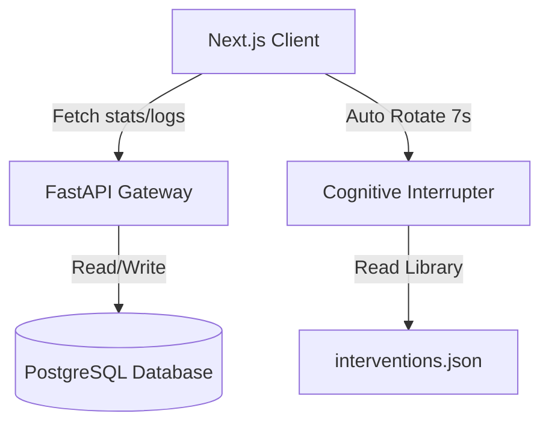

# Recovery Sobriety Subsystem & Cognitive Interrupter

* **Approximate Engineering Effort**: 14 hours
* **Status**: Production Deployment

---

## 1. Overview
The **Recovery Sobriety Subsystem** is an integrated module in Warborn OS designed to assist users in managing behavioral recovery. Rather than serving as a static quote display, it acts as an active **behavioral intervention engine** and recovery capital compiler. It tracks real-time sobriety durations, aggregates financial and temporal capital reclaimed, registers relapse events with cognitive trigger notes, and delivers timed, randomized psychological pattern-interrupt overlays.

---

## 2. The Problem
Behavioral habits and addictive cycles are largely driven by automatic, sub-conscious execution loops. When a trigger occurs, the brain immediately defaults to the automated action path before the prefrontal cortex can assess the decision. Static tracking widgets only display cumulative stats after the fact; they fail to interrupt the decision-making process at the point of action. 

To create a system that actively helps break automated loops, we needed to:
1. Provide real-time motivational context (reclaimed hours and currency).
2. Establish a cognitive friction layer that prompts mindfulness immediately before or during times of stress.
3. Keep track of relapse metadata (mood, triggers, context) to identify personal patterns over time.

---

## 3. Architecture
The system consists of a PostgreSQL schema storing active recovery stats and relapse logs, a FastAPI router exposing CRUD operations for logs, and a Next.js front-end containing the cockpit tracking layout and the dynamic pattern-interrupt overlay.



### Database Schema (`models/recovery.py`)
- **`SobrietyTracker`**: Stores start date, daily cost rate, target metrics, and currency configurations.
- **`RelapseLog`**: Stores timestamps, pre-relapse mood values (1 to 5), trigger categories, and freeform text descriptions.

---

## 4. Implementation Details

### The Cognitive Interrupter (`components/recovery-intervention.tsx`)
The interrupter reads from a JSON library containing **102 unique prompts** across Stoicism, Neuroscience, Atomic Habits, and Mindfulness. It cycles these prompts every **7 seconds** utilizing a smooth 700ms slide-and-fade animation.
To prevent cognitive fatigue and guarantee freshness, it implements a smart category rotation check:
```typescript
// Space out categories so consecutive prompts never share the same source type
const lastFifteenShown = useRef<string[]>([]);
const getNextIntervention = () => {
  const filtered = library.filter(item => !lastFifteenShown.current.includes(item.id));
  const selection = filtered.length > 0 ? filtered : library;
  const picked = selection[Math.floor(Math.random() * selection.length)];
  
  lastFifteenShown.current.push(picked.id);
  if (lastFifteenShown.current.length > 15) lastFifteenShown.current.shift();
  return picked;
};
```

---

## 5. Challenges & Tradeoffs
- **Real-Time Timers**: Running standard React hooks updating timers at millisecond intervals caused massive re-renders across the dashboard layout, slowing down typing inside adjacent notes blocks. We decoupled the timer ticks to a wrapper, using local React state and memoizing calculations.
- **Trigger Logging Isolation**: Writing to database logs during relapse checks could result in slow requests if connection pools are saturated. We write entries asynchronously and update local client state optimistically.

---

## 6. Lessons & Future Improvements
- **IP-Based Currency Automation**: Automatically detecting the client's locale and adjusting currency displays (e.g. `$`, `₹`, `£`) prevents layout shifts and improves initial dashboard loading.
- **Future Personalization**: Using local user behavior history (e.g. logging higher stress levels at 8:00 PM) to dynamically serve Stoic prompts instead of purely random rotations.

---

## 7. References
- *Atomic Habits* by James Clear (Identity-based behavioral cycles)
- *Stoic Meditations* by Marcus Aurelius (Mindfulness and cognitive grounding)
- *Neuroscience of Addiction* (Dopamine baseline reset tracking models)
