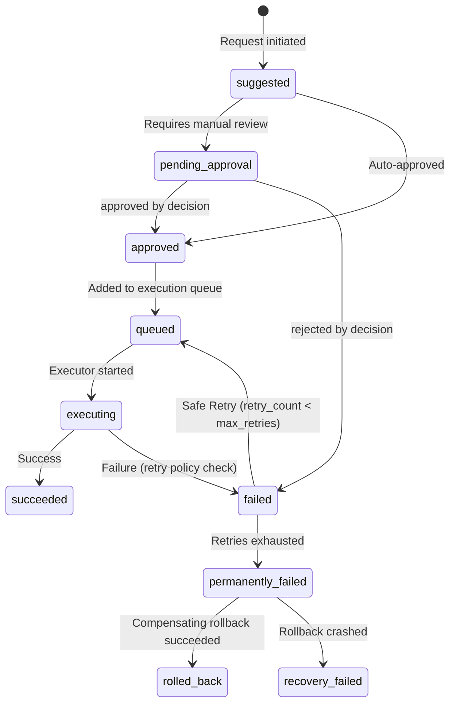

# Action Execution Lifecycle

This document describes the structured state transitions that every user action undergoes in the Warborn OS.

## State Transitions Flow

## Lifecycle States Reference

| State Name | Description |
|---|---|
| `suggested` | The action suggestion has been logged. |
| `pending_approval` | Action is waiting for the user to approve/deny. |
| `approved` | Action is cleared for execution. |
| `queued` | Action has entered the local processing queue. |
| `executing` | Executor is actively running the tool logic. |
| `succeeded` | Execution finished with a status of success. |
| `failed` | A runtime error or validation error crashed execution. |
| `rolled_back` | Compensation hooks ran and successfully reversed all side effects. |
| `permanently_failed` | No further retries allowed, and rollback failed or was skipped. |

## Timestamp Observability Fields
The database log tracks exact timestamps for audit logging:
- `suggested_at`
- `approved_at`
- `queued_at`
- `execution_started_at`
- `executed_at`
- `failed_at`
- `rolled_back_at`
