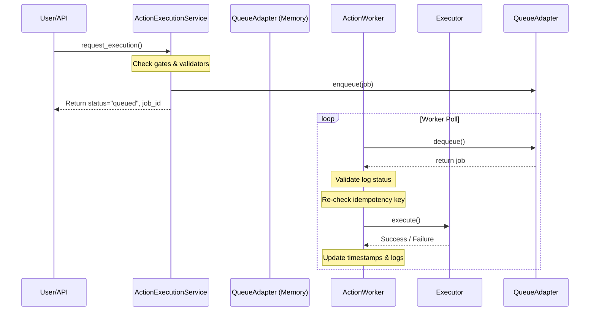

# Asynchronous Action Execution

This document details the background queue structure and job execution pathways.

## Architecture Diagram

## Active Queue Adapters
- `MemoryQueueAdapter`: Wraps `asyncio.Queue` for sandboxed, database-mocked, thread-safe asynchronous local execution.
