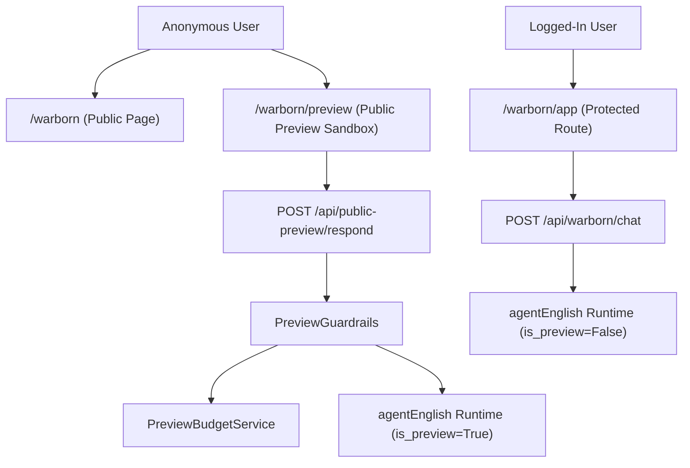

# Warborn Public Preview Architecture

This document maps out the public/private separation model between the authenticated Warborn OS system and the restricted public agentEnglish preview.

## Architecture Diagram

## Key Isolation Boundaries
1. **Public rate limit constraints**: Anonymous users are throttled to 10 requests per minute by the `PreviewRateLimitMiddleware`.
2. **Preview session caps**: Limit of 5 turns per session, tracked strictly via the in-memory `PreviewBudgetService`.
3. **Intent limitations**: Restricts agent queries only to English correction, rephrasing, Hinglish explanation, and translation. All other queries are blocked by `classify_intent` in the agent runtime.
4. **Tenant-Safe separation**: Private logs, credentials database connection, and storage operations are completely hidden from anonymous preview users.
