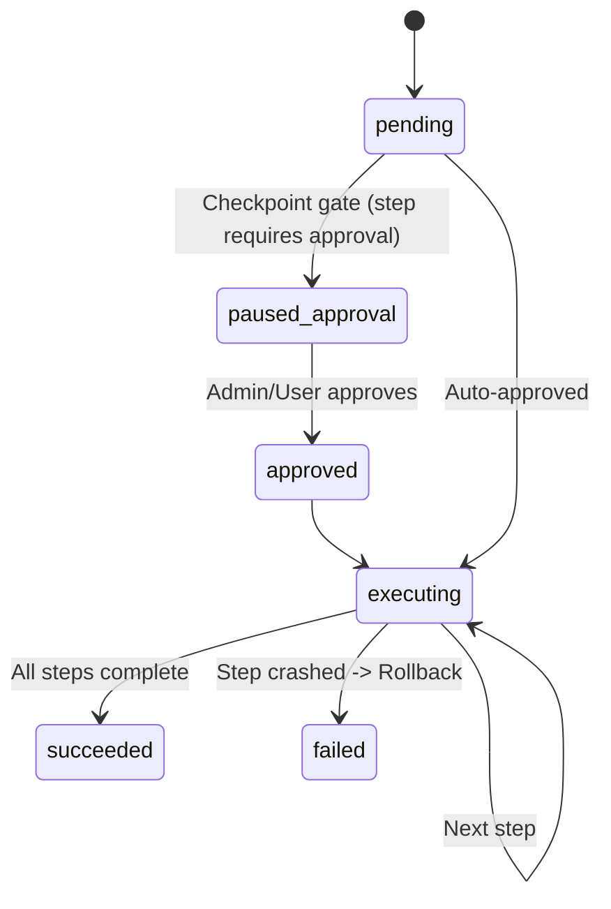

# Multi-Step Workflow Orchestration

Handles compilation, validation, execution steps, and rollbacks.

## Execution Sequence

## Resumption & Rollback
- Resumes execution after approval via `WorkflowStateManager.approve_and_resume`.
- In case of failure at any step, `WorkflowExecutionService.rollback_workflow` triggers compensating rollbacks for previously succeeded steps.
