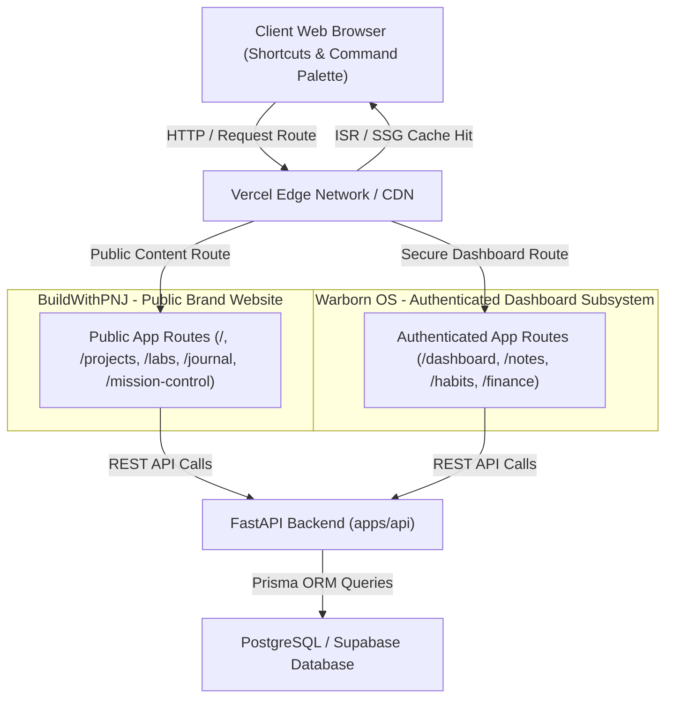

# System Architecture Spec (01_SYSTEM_ARCHITECTURE.md)

This document describes the high-level platform architecture, request pipelines, rendering strategies, and future scaling blueprints for the **BuildWithPNJ** brand website and its integrated authenticated subsystem, **Warborn OS**.

---

## 1. Public Brand & Authenticated Subsystem Relationship

BuildWithPNJ is the single root repository and application. It is divided into two distinct zones sharing one unified database and session authentication model:

- **BuildWithPNJ (Public Brand Website)**: Represents the public face of the platform. Serves static, search-optimized pages detailing projects, R&D labs, and the engineering journal.
- **Warborn OS (Authenticated Dashboard Subsystem)**: Accessible strictly after user authorization under `/dashboard`. Acts as the local developer operating system managing personal notes, habit logs, finance trackers, book lists, dynamic tools, and future AI agent workflows.

---

## 2. Monorepo Modules Relationships

Inside the Turborepo monorepo, packages are configured to isolate configurations and maximize compiler cache hits:

- **`apps/web`**: Next.js 15 App Router web interface containing both the public pages (BuildWithPNJ) and the authenticated client dashboard workspace (Warborn OS).
- **`apps/api`**: FastAPI service wrapping calculations, telemetry endpoints, and external webhook bindings.
- **`packages/shared-types`**: TypeScript type declarations shared across the frontend and API layers.
- **`packages/config`**: Pre-configured ESLint, TypeScript, and Tailwind configurations inherited by applications.

---

## 3. Rendering Strategy Matrix

To minimize latency and optimize Core Web Vitals, the platform uses a hybrid rendering system:

| Route Path | Subsystem Context | Rendering Strategy | Rationale |
| :--- | :--- | :--- | :--- |
| `/` (Homepage) | BuildWithPNJ | Static (ISR / SSG) | Instant loading speed, pre-rendered marketing nodes. Revalidated hourly. |
| `/projects` | BuildWithPNJ | Static (ISR) | Reads list dynamically from Markdown FS. Refreshed on content updates. |
| `/projects/[slug]` | BuildWithPNJ | Static (ISR) | Dynamic markdown compiling. Static cache generation. |
| `/labs` | BuildWithPNJ | Static (ISR) | R&D listings, pre-compiled static pages. |
| `/labs/[slug]` | BuildWithPNJ | Static (ISR) | R&D details, static content compiling. |
| `/journal` | BuildWithPNJ | Static (ISR) | Blog post directories, static index compiling. |
| `/journal/[slug]` | BuildWithPNJ | Static (ISR) | Long-form reading pages, fully static pre-rendered prose. |
| `/mission-control` | BuildWithPNJ | Dynamic (SSR) | Commands lists, sprint telemetry, live metric status updates. |
| `/dashboard/*` | Warborn OS | Dynamic (Client-Side CSR) | Authenticated personal dashboard, requires browser-only auth states. |

---

## 4. Platform Request Flow

A typical client request follows this pipeline:

1. **Routing**: Vercel Routing Layer determines whether the route is static or dynamic.
2. **Static Compilation (ISR/SSG)**: Next.js returns pre-rendered HTML from the Vercel Edge Cache (e.g., for BuildWithPNJ public pages).
3. **Data Fetching (Dynamic Routes)**:
   - For `/mission-control` and authenticated Warborn OS dashboard sections, React Server Components perform data queries on the server.
   - For client-interactive state operations (e.g., checking off a habit inside Warborn OS), the browser client queries `apps/api` via REST.
4. **Backend Processing**: FastAPI parses incoming requests, coordinates with PostgreSQL/Supabase, and returns standard JSON payloads.

---

## 5. Future Scalability Blueprint

As the platform transitions to support active AI operating features inside Warborn OS:

- **Edge APIs**: Deploy performance-critical API paths to Vercel Edge Middleware or Cloudflare Workers.
- **Async Processing**: Deploy a Redis-backed Celery worker pool to handle long-running model evaluations and automated sync tasks asynchronously.
- **Multi-Tenant DB Partitioning**: Partition the PostgreSQL database by user IDs to safeguard data isolation and query velocities in the dashboard.
