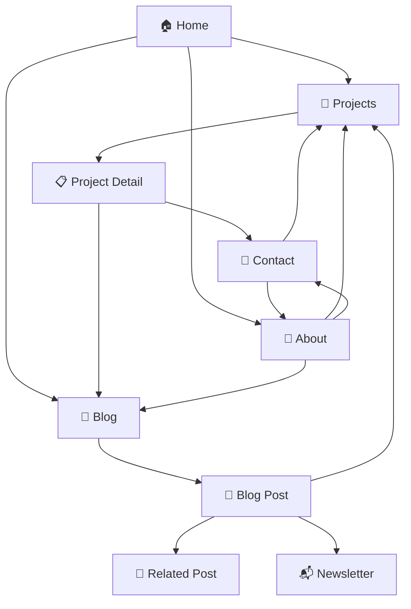

# BuildWithPNJ — Information Architecture

> The structural blueprint of the BuildWithPNJ website.
> Defines how content is organized, connected, and navigated.

---

🌐 buildwithpnj.com (Public Brand Website)
│
├── / ─────────────────────────── Home (Landing Page)
│
├── /projects ─────────────────── Projects Listing Hub
│   └── /projects/[slug] ──────── Project Details (Tech stack, timeline, github)
│
├── /labs ─────────────────────── R&D Labs Hub (Experimental categories)
│   ├── AI Agents
│   ├── Design Lab
│   ├── Voice AI
│   ├── Automation
│   ├── LLMs
│   ├── Research
│   └── Open Source
│
├── /journal ──────────────────── Engineering Journal (Articles listing)
│   └── /journal/[slug] ───────── Dynamic Article Page (with dynamic TOC)
│
├── /mission-control ──────────── Mission Control (Live telemetry, heatmaps)
│   
├── /about ────────────────────── About & Career Timeline
│
├── /contact ──────────────────── Contact links directory
│
└── /dashboard (Private Hub) ─── Warborn OS (Authenticated developer workspace)
      │
      ├── /dashboard ──────────── Personal OS Dashboard view
      ├── /notes ──────────────── Note drafts (Google Drive synchronized)
      ├── /books ──────────────── Personal library check-ins
      ├── /finance ────────────── Transactions ledger tracker
      ├── /storage ────────────── File asset uploads manager
      ├── /habits ────────────── Daily check-ins checklist grid
      ├── /tools ──────────────── Command shortcut and utility triggers
      ├── /agent-inbox ────────── Developer agent messaging portal
      ├── /ai-workspace ───────── Dynamic local LLM prompts box
      ├── /knowledge-base ─────── Vectorized semantic research files
      ├── /projects-manager ───── Active workflow tasks
      ├── /content-manager ────── Articles scheduler pipeline
      ├── /automation ─────────── Cron triggers monitor
      └── Future AI Features ──── Local OS integrations directory

---

## 2. Navigation Structure

### 2.1 Primary Navigation (Top Bar)

Persistent across all pages. Sticky on scroll.

```
┌──────────────────────────────────────────────────────────────────┐
│  [Logo/PNJ]     Projects    Blog    About    Contact    [CTA]   │
└──────────────────────────────────────────────────────────────────┘
```

| Item | Link | Notes |
|---|---|---|
| Logo / Brand Mark | `/` | Wordmark on desktop, icon on mobile |
| Projects | `/projects` | Dropdown on hover (optional v2) |
| Blog | `/blog` | Main content hub |
| About | `/about` | Personal story |
| Contact | `/contact` | Get in touch |
| **CTA Button** | `/newsletter` or GitHub | Accent-colored, right-aligned |

### 2.2 Mobile Navigation

Hamburger menu → full-screen overlay slide-in:

```
┌──────────────────────────┐
│  [Logo]           [☰]   │
└──────────────────────────┘

  Expanded:
┌──────────────────────────┐
│                    [✕]   │
│                          │
│     Projects             │
│     Blog                 │
│     About                │
│     Contact              │
│                          │
│   ─────────────────────  │
│   [GitHub]  [X]  [LI]   │
│                          │
│     © BuildWithPNJ       │
└──────────────────────────┘
```

### 2.3 Footer Navigation

```
┌──────────────────────────────────────────────────────────────────┐
│                                                                  │
│  BuildWithPNJ                    Navigation      Connect         │
│  AI Engineering ×                ──────────      ─────────       │
│  Building in Public              Home            GitHub          │
│                                  Projects        Twitter/X       │
│  © 2026 BuildWithPNJ             Blog            LinkedIn        │
│  All rights reserved.            About           Email           │
│                                  Contact         RSS (v2)        │
│                                                                  │
│  ──────────────────────────────────────────────────────────────  │
│  Built with Next.js · Deployed on Vercel · Source on GitHub      │
└──────────────────────────────────────────────────────────────────┘
```

---

## 3. Content Model

### 3.1 Project

| Field | Type | Required | Notes |
|---|---|---|---|
| `title` | String | ✅ | Project name |
| `slug` | String | ✅ | URL-safe identifier |
| `tagline` | String | ✅ | One-line description |
| `description` | MDX | ✅ | Full project write-up |
| `status` | Enum | ✅ | `active`, `complete`, `archived`, `planned` |
| `featured` | Boolean | ✅ | Pin to homepage |
| `thumbnail` | Image | ✅ | Card preview image (16:9) |
| `screenshots` | Image[] | ❌ | Gallery images |
| `techStack` | String[] | ✅ | Technology tags |
| `category` | Enum | ✅ | `saas`, `open-source`, `tool`, `experiment` |
| `liveUrl` | URL | ❌ | Live demo link |
| `githubUrl` | URL | ❌ | Source code link |
| `startDate` | Date | ✅ | When development began |
| `publishDate` | Date | ✅ | When showcased publicly |

### 3.2 Blog Post

| Field | Type | Required | Notes |
|---|---|---|---|
| `title` | String | ✅ | Post title |
| `slug` | String | ✅ | URL-safe identifier |
| `excerpt` | String | ✅ | 1–2 sentence summary (meta description) |
| `content` | MDX | ✅ | Full post body |
| `publishDate` | Date | ✅ | Publication date |
| `updatedDate` | Date | ❌ | Last updated |
| `tags` | String[] | ✅ | Categorization tags |
| `coverImage` | Image | ❌ | Hero image / OG image |
| `readingTime` | Number | Auto | Calculated from word count |
| `featured` | Boolean | ❌ | Pin to homepage |
| `draft` | Boolean | ✅ | Hide from public listings |
| `relatedPosts` | Slug[] | ❌ | Links to related content |

### 3.3 Tag Taxonomy

Standardized tags used across blog posts and projects:

| Category | Tags |
|---|---|
| **Languages** | `python`, `typescript`, `javascript`, `sql` |
| **Frontend** | `nextjs`, `react`, `tailwindcss`, `shadcn-ui` |
| **Backend** | `fastapi`, `sqlalchemy`, `celery`, `alembic` |
| **AI/ML** | `ai`, `llm`, `rag`, `multi-agent`, `prompt-engineering`, `pgvector` |
| **Infrastructure** | `docker`, `vercel`, `postgresql`, `redis`, `ci-cd` |
| **Topics** | `build-in-public`, `architecture`, `tutorial`, `case-study`, `hot-take` |

---

## 4. Page Hierarchy & Content Depth

```
Level 0 (Hub)          Level 1 (Listing)        Level 2 (Detail)
─────────────          ────────────────          ────────────────
Home ──────────────────┐
                       ├── Projects ────────────── /projects/[slug]
                       ├── Blog ────────────────── /blog/[slug]
                       ├── About
                       ├── Contact
                       └── Newsletter
```

| Level | Purpose | Scroll Depth | Avg. Time on Page |
|---|---|---|---|
| **L0 — Home** | Hook, orient, funnel to L1 | 3–4 screens | 30–60s |
| **L1 — Listing** | Browse, discover, filter | 2–5 screens | 45–90s |
| **L2 — Detail** | Deep read, learn, engage | 5–15 screens | 3–8 min |

---

## 5. Internal Linking Strategy

Cross-link aggressively to keep visitors exploring:



| From | Link To | How |
|---|---|---|
| Blog post about Personal OS | `/projects/personal-os` | Inline mention + card |
| Project page | Related blog posts | "Read more" section |
| About page | Featured projects | "What I'm building" section |
| Every page (footer) | Newsletter | Footer CTA |
| Blog post | Other blog posts | "Related posts" sidebar/bottom |
| Home | Everything | Featured sections with "View all →" |

---

## 6. URL Structure Conventions

| Pattern | Example | Rule |
|---|---|---|
| Static pages | `/about`, `/contact` | Lowercase, no trailing slash |
| Project pages | `/projects/personal-os` | Kebab-case slugs |
| Blog posts | `/blog/building-personal-os-with-ai` | Kebab-case, descriptive |
| Tag pages | `/blog/tag/fastapi` | Lowercase tag name |
| Assets | `/og/blog/[slug].png` | OG image generation route |

**URL Rules:**
- No dates in blog URLs (allows evergreen updates)
- Slugs are permanent — never change once published
- Redirects for any renamed content (301)
- Max URL depth: 3 segments

---

## 7. Search & Discovery

### 7.1 On-Site (v2)

| Feature | Implementation |
|---|---|
| Blog search | Client-side fuzzy search (Fuse.js) over pre-built index |
| Tag filtering | URL-based (`/blog/tag/[tag]`) with active filter UI |
| Project filtering | Client-side filter by tech stack / status |
| Command palette | `Cmd+K` quick nav (stretch goal) |

### 7.2 External (SEO)

| Channel | Strategy |
|---|---|
| Google | Structured data (JSON-LD), sitemap, meta tags, descriptive URLs |
| Twitter/X | OG images, Twitter Cards (`summary_large_image`) |
| LinkedIn | OG tags, professional meta descriptions |
| Dev.to / Hashnode | Canonical URLs pointing back to `buildwithpnj.com` |

---

## 8. Content Relationships Diagram

```
┌─────────────┐     has many     ┌─────────────┐
│   Project   │ ───────────────► │  Blog Post  │
│             │ ◄─────────────── │             │
│  - slug     │   references     │  - slug     │
│  - stack[]  │                  │  - tags[]   │
│  - status   │                  │  - excerpt  │
└─────────────┘                  └─────────────┘
       │                                │
       │ tagged with                    │ tagged with
       ▼                                ▼
┌─────────────┐                  ┌─────────────┐
│    Tag      │ ◄────────────────│    Tag      │
│             │   shared pool    │             │
│  - name     │                  │  - name     │
│  - category │                  │  - category │
└─────────────┘                  └─────────────┘
```

---

*Last updated: 2026-07-04*
