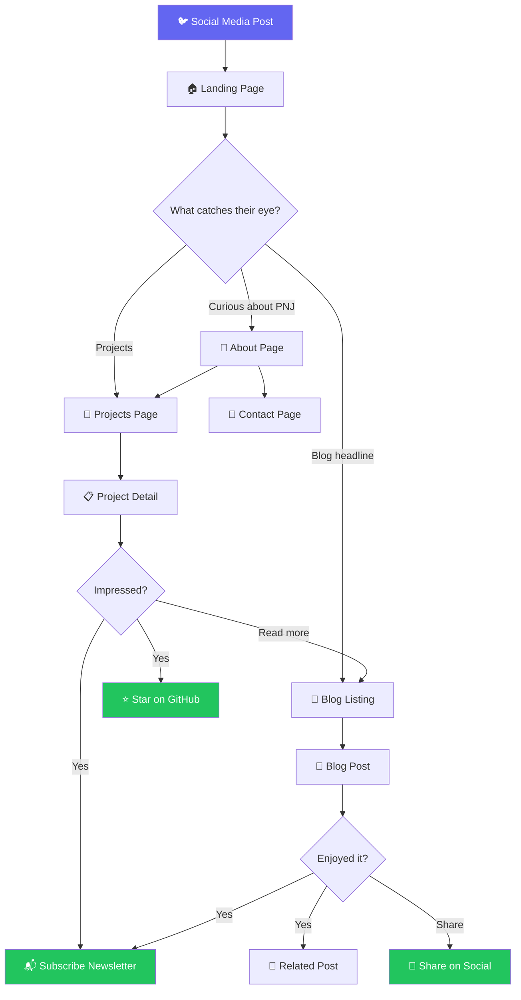
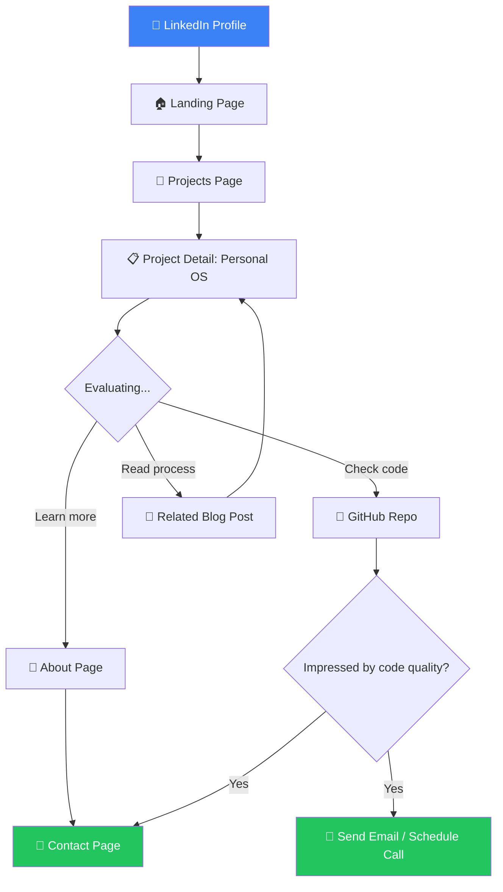
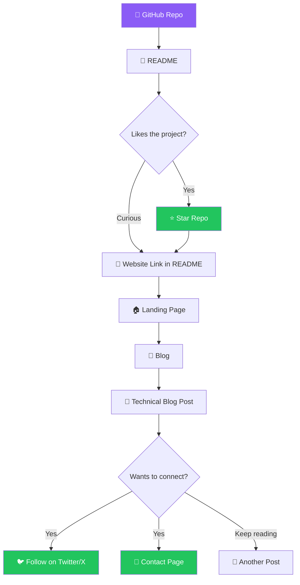
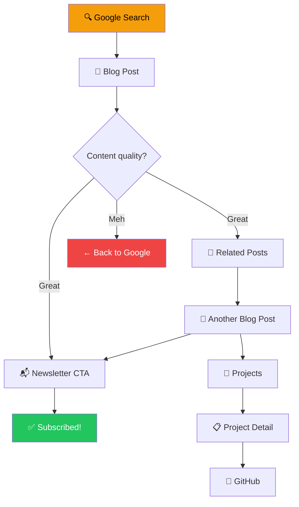

# BuildWithPNJ — UX Flow

> User journey maps and interaction flows for the BuildWithPNJ website.
> Every flow is designed to move visitors toward a conversion goal.

---

## 1. Core User Flows

### 1.1 Flow A — First-Time Visitor (Social Media → Explore)

The most common entry path: someone clicks a link from Twitter/X or LinkedIn.



**Conversion goals:** ⭐ GitHub star, 📬 Newsletter signup, 🔗 Social share

**Key design decisions:**
- Hero must communicate value in < 5 seconds
- Every page has a clear next action (never a dead end)
- Featured content is curated, not just chronological

---

### 1.2 Flow B — Hiring Manager (LinkedIn → Evaluate)

A recruiter or engineering manager evaluating PNJ's technical skills.



**Conversion goal:** 📩 Contact / reach out for opportunity

**Key design decisions:**
- Projects page is the centerpiece for this persona
- Every project page links to GitHub and has architecture detail
- About page positions PNJ as a senior-level thinker

---

### 1.3 Flow C — Fellow Builder (GitHub → Connect)

A developer discovers PNJ through GitHub or a technical blog post.



**Conversion goals:** ⭐ Star, 🐦 Social follow, 📧 Contact for collab

---

### 1.4 Flow D — Blog Reader (Search → Subscribe)

Organic traffic from Google landing on a specific blog post.



**Conversion goal:** 📬 Newsletter subscription

**Key design decisions:**
- Blog posts must stand alone (no context required)
- Related posts keep readers on-site
- Newsletter CTA appears mid-post AND at bottom

---

## 2. Micro-Interactions

### 2.1 Page Load Sequence

```
T+0ms    ── Page shell renders (layout, nav, footer)
T+100ms  ── Hero background animation starts
T+200ms  ── Headline fades in from bottom
T+350ms  ── Subheadline fades in
T+500ms  ── CTA buttons fade in with subtle scale
T+700ms  ── Below-fold content begins loading
```

### 2.2 Scroll Interactions

| Trigger | Animation | Element |
|---|---|---|
| Section enters viewport | Fade up + slide (20px) | Section headings |
| Card enters viewport | Stagger fade-in (100ms delay each) | Project/blog cards |
| 50% scroll depth | Subtle parallax | Hero background |
| Scroll past hero | Nav background becomes solid | Navigation bar |
| Scroll to bottom | Newsletter CTA pulses once | Footer CTA |

### 2.3 Hover & Click States

| Element | Hover | Active/Click |
|---|---|---|
| **Project card** | Scale 1.02, border glow (indigo), shadow lift | Scale 0.98, navigate |
| **Blog card** | Background lighten, title color → accent | Navigate to post |
| **CTA button** | Gradient shift, subtle glow | Scale 0.95, ripple |
| **Nav link** | Underline slide in from left | Color → accent |
| **Social icon** | Scale 1.15, color → brand color | Open in new tab |
| **Code block** | Copy button appears | "Copied!" tooltip |
| **Tag pill** | Background fill | Filter by tag |

---

## 3. Key Interaction Patterns

### 3.1 Newsletter Signup Flow

```
┌────────────────────────────────────────────────────┐
│                                                    │
│  🚀 Stay in the loop                              │
│                                                    │
│  AI engineering insights, build updates,           │
│  and things I wish I knew earlier.                 │
│                                                    │
│  ┌──────────────────────────┐  ┌───────────────┐  │
│  │ your@email.com           │  │  Subscribe ▶  │  │
│  └──────────────────────────┘  └───────────────┘  │
│                                                    │
│  No spam. Unsubscribe anytime.                     │
│                                                    │
└────────────────────────────────────────────────────┘

         ↓ On submit (success)

┌────────────────────────────────────────────────────┐
│                                                    │
│  ✅ You're in!                                     │
│                                                    │
│  Check your inbox for a confirmation.              │
│  Welcome to the builder crew.                      │
│                                                    │
└────────────────────────────────────────────────────┘
```

### 3.2 Contact Form Flow

```
Step 1: Fill form
┌────────────────────────────────────┐
│  Name        [________________]   │
│  Email       [________________]   │
│  Subject     [▼ Select one    ]   │
│              ├─ Collaboration     │
│              ├─ Freelance/Hire    │
│              ├─ Question          │
│              └─ Other             │
│  Message     [                ]   │
│              [                ]   │
│              [________________]   │
│                                   │
│         [ Send Message ▶ ]        │
└────────────────────────────────────┘

Step 2: Sending
┌────────────────────────────────────┐
│        [⟳ Sending...]             │
└────────────────────────────────────┘

Step 3: Success
┌────────────────────────────────────┐
│  ✅ Message sent!                  │
│                                    │
│  I'll get back to you within       │
│  48 hours. In the meantime,        │
│  check out my latest blog post →   │
└────────────────────────────────────┘
```

### 3.3 Blog Post Reading Experience

```
┌─────────────────────────────────────────────────┐
│  [← Back to Blog]                               │
│                                                  │
│  Building a Personal OS with FastAPI             │
│  ───────────────────────────────────             │
│  Jul 4, 2026  ·  8 min read  ·  #fastapi #ai    │
│                                                  │
│  [Cover Image]                                   │
│                                                  │
│  ┌─────────────────┐                             │
│  │ TABLE OF         │  Body content...           │
│  │ CONTENTS         │                            │
│  │ ─────────────    │  ## Section Heading        │
│  │ 1. Introduction  │                            │
│  │ 2. Architecture  │  Paragraph text with       │
│  │ 3. Database  ◄── │  inline `code` and         │
│  │ 4. Learnings     │  [links](#).               │
│  └─────────────────┘                             │
│                                                  │
│  ```python                          [📋 Copy]   │
│  async def get_dashboard():                      │
│      return await db.fetch_all()                 │
│  ```                                             │
│                                                  │
│  ─────────────────────────────────────           │
│                                                  │
│  📬 Enjoyed this? Subscribe for more.            │
│  [your@email.com]  [Subscribe ▶]                 │
│                                                  │
│  ─────────────────────────────────────           │
│                                                  │
│  Related Posts                                   │
│  ┌──────────┐ ┌──────────┐ ┌──────────┐         │
│  │ Post 1   │ │ Post 2   │ │ Post 3   │         │
│  └──────────┘ └──────────┘ └──────────┘         │
│                                                  │
│  [Share: 🐦 Twitter  💼 LinkedIn  🔗 Copy]       │
└─────────────────────────────────────────────────┘
```

---

## 4. Navigation Flow States

### 4.1 Active Page Indicators

| State | Visual Treatment |
|---|---|
| **Current page** | Nav link has accent underline + bold weight |
| **Hovered** | Underline slides in from left, color shift |
| **Default** | Muted text color, no underline |

### 4.2 Page Transitions

| Transition | Animation |
|---|---|
| Page → Page | Content crossfade (200ms ease-out) |
| List → Detail | Card expands into page (shared layout animation) |
| Back navigation | Reverse of entry animation |

---

## 5. Error & Empty States

| State | Content | CTA |
|---|---|---|
| **404 Page** | "Looks like this page drifted into the void." | "Go Home" / "Browse Projects" |
| **No blog posts for tag** | "No posts tagged with [tag] yet." | "View all posts" |
| **Contact form error** | "Something went wrong. Try again or email me directly." | "Retry" / email link |
| **Newsletter already subscribed** | "You're already on the list! 🎉" | "Browse the blog" |
| **Offline** | "You're offline. Some content may be cached." | None (graceful degradation) |

---

## 6. Conversion Funnel Summary

```
AWARENESS ──────► INTEREST ──────► ENGAGEMENT ──────► CONVERSION
                                                       
Social post       Hero impresses   Reads blog post    ⭐ GitHub star
Google search     Browses projects  Views project      📬 Subscribes
GitHub repo       Clicks "About"   Clicks GitHub       📧 Contacts
Referral link     Reads tagline    Shares content      🐦 Follows
                                   Returns next week   💼 Hires
```

---

*Last updated: 2026-07-04*
