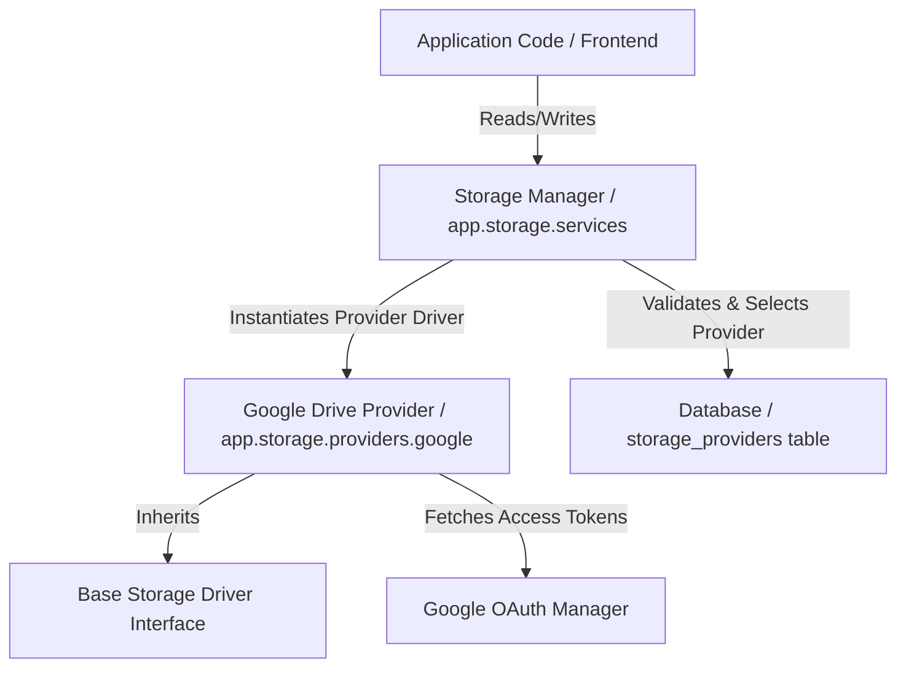

# Storage Architecture Spec — Warborn OS

This document explains the multi-account Google Drive storage virtualization architecture implemented inside the backend.

## Architecture Layer Diagram

## Module Subdirectory Layout

All code related to the storage management subsystem is located in `app/storage`:

- **`/app/storage/`** — Subsystem root
  - **`__init__.py`** — Exposes primary `StorageManager` API
  - **`config.py`** — Subsystem-specific Settings config validation (inheriting raw environment configurations)
  - **`routes.py`** — FastAPI routes (`/api/storage/...`)
  - **`services.py`** — Core `StorageManager` orchestrating dynamic file categories and fallback providers
  - **`utils.py`** — Cryptographic helper functions (AES Fernet) for securing secrets
  - **`providers/`** — Drivers folder
    - **`base.py`** — `BaseStorageProvider` abstract base class
    - **`google/`** — Google Drive driver implementation
      - **`provider.py`** — `GoogleDriveProvider` executing async API calls via executor threads
      - **`oauth.py`** — `GoogleOAuthManager` handling redirects, code exchanges, and user emails
