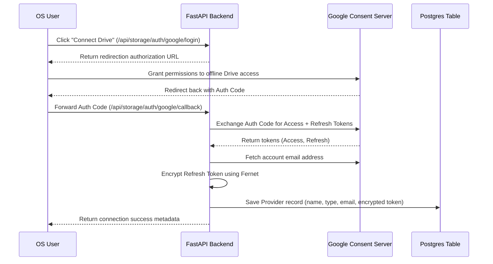

# OAuth Flow Specification — Warborn OS

This document explains the OAuth 2.0 connection and refresh process for storage providers.

## Connection Flow Chart

## Token Storage Security

- Client secret and client ID are loaded directly from the system environment.
- The authorization code is used once to obtain token sets and never cached.
- The returned refresh token is encrypted with the `ENCRYPTION_KEY` using **Fernet (symmetric AES-128)** before writing to the `storage_providers` database.
- Future access uses the refresh token to dynamically retrieve access tokens.
